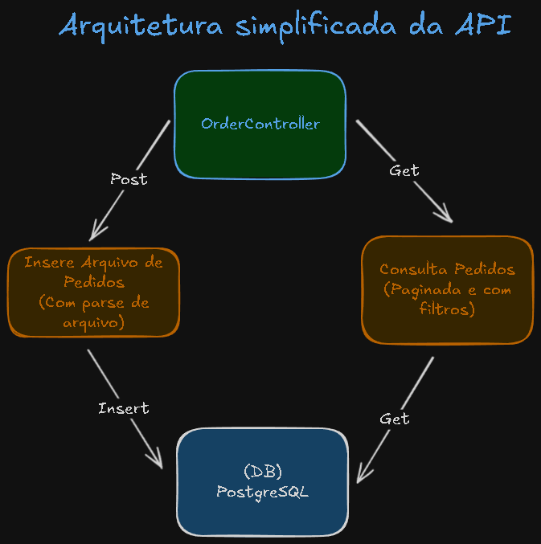

# Projeto para Desafio Vertical Logística

## Descrição e explicando algumas decisões TL;DR :)

Para este projeto utilizei
[NestJS](https://github.com/nestjs/nest) framework por sua relação com o desafio, mas ressalto que outros poderiam ser igualmente usados com sucesso, por exemplo [Fastify](https://fastify.dev/), [Express](https://expressjs.com/), entre outros. O NestJS permite o uso de vários tipos de arquitetura e padrões de projetos. Como uma das solicitações para esse desafio foi simplicidade escolhi a arquitetura Modular (ou de Módulos). A mesma funciona muito bem para diferentes tamanhos de projetos pois permite criar aplicações com baixo acoplamento, e é muito relacionada a própria estrutura do framework.

#

### Desenho Arquitetura



#

### Swagger

O projeto está utiliza o swagger sendo possível após a configuração do projeto acessar o endpoint [localhost:3000/api](http://localhost:3000/api) para ter acesso aos endpoints, facilitando integrações com o serviço via rest. E facilitando a documentação.

#

### Algumas observações importantes =)

> Por que PostgreSQL?<br> Pois os dados são estruturados e bem definidos. Logo se encaisa muito bem na estrutura relacional.

> Por que não usar o Multer para o upload?<br> Pois ele pode prejudicar o desempenho da aplicação em caso de arquivos muito grandes, por exemplo esgotar a memória do servidor.

> Por que não foi adicionado CircuitBreaker, Rate limiting, sistema de fallback, logging, autenticação, segurança das variáveis de ambiente, entre outros?<br>Apenas pelo tempo que tive para executar esse projeto, mas compreendo a importância desses tópicos para aplicações de tamanhos variados.

> Testes?<br>Os testes em excesso podem gerar uma dor de cabeça com o tempo, se tornando muito custosos em termos de infraestrutura e prejudicando a esteira de desenvolvimento. Por isso foquei apenas em alguns pontos. E não em buscar 100% de coverage.

> O histórico do git?<br> Está utilizando conventional comits. Porém sem 'refactor:' pois acabei nesse caso específico por limite de tempo criando todo o projeto de uma vez. Então estará um pouco diferente do recomendado que seriam commits menores e com estrutura bem definida de nomenclatura.

> Automação?<br>Feita com auxílio de Docker e docker compose. Aproveitando estágios do build, preservando volumes com artefatos para serem reaproveitados por outros estágios.

> Por que foi utilizado query nativa com CTE?<br>A utilização de CTEs do PostgreSQL foi para simplificar a consulta complexa, dentre outras melhorias como performance e manutenabilidade.

## Execução do projeto com docker compose

Com o docker instalado execute ([Instalação Docker](https://docs.docker.com/engine/install)):

```bash
# Na pasta do projeto execute:
$ npm i && docker compose up -d
```

## Após estar com os containers sendo executados corretamente

Basta acessar a url: http://localhost:3000/api para ter acesso a documentação e aos os testes.

## Para execução local

Execute o comando abaixo dentro da pasta do projeto:

```bash
$ npm install
```

## Você precisará ter o PostgreSQL rodando e acessível com as seguintes configurações

```bash
DATABASE_HOST=localhost
DATABASE_PORT=5432
DATABASE_USER=test_user
DATABASE_PASSWORD=test_pass
DATABASE_NAME=postgres
DATABASE_SCHEMA=public
DATABASE_SYNCHRONIZE=true
```

## Compilar e rodar o projeto

```bash
# development
$ npm run start

# watch mode
$ npm run start:dev
```

## Executar os testes

```bash
# unit tests
$ npm run test

# e2e tests
$ npm run test:e2e

# test coverage
$ npm run test:cov
```
